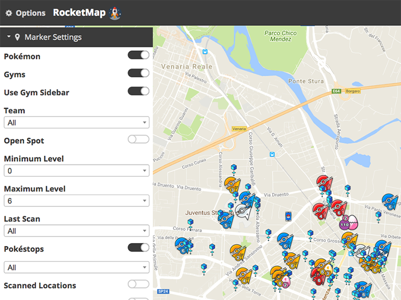

Welcome to RocketMAD's Documentation!
=========================================

RocketMAD gives you a map with nearby Pokémon, PokéStops, Gyms, and much more in the form of a web-app as well as a native phone application.
It visualizes data scanned by `MAD <https://github.com/Map-A-Droid/MAD>`_. RocketMAD does not work as standalone and the code has been heavily modified to only work with MAD. This frontend is based on `RocketMap <https://github.com/RocketMap/RocketMap>`_.

[ Wanting to install and run RocketMAD for the first time? `Start here! <https://rocketmad.readthedocs.io/en/latest/basic-install/index.html>`_ ]

[ `Official GitHub <https://github.com/cecpk/RocketMAD>`_ ] [ `Discord Support <https://discordapp.com/invite/7TT58jU>`_ ] [ `GitHub Issues <https://github.com/cecpk/RocketMAD/issues>`_ ]

.. toctree::
    :titlesonly:
    :maxdepth: 1
    :caption: About
    :glob:

    about/index
    about/*

.. toctree::
    :titlesonly:
    :maxdepth: 1
    :caption: Basic Installation
    :glob:

    basic-install/index
    basic-install/windows
    basic-install/osx
    basic-install/linux
    basic-install/google-maps

.. toctree::
    :titlesonly:
    :maxdepth: 1
    :caption: First Run
    :glob:

    first-run/*

.. toctree::
    :titlesonly:
    :maxdepth: 1
    :caption: Common Issues
    :glob:

    common-issues/*

.. toctree::
    :titlesonly:
    :maxdepth: 1
    :caption: Extras
    :glob:

    extras/*

.. toctree::
    :titlesonly:
    :maxdepth: 1
    :caption: Advanced Installation
    :glob:

    advanced-install/*
